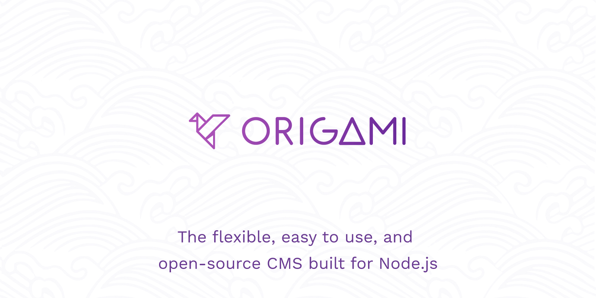

Â# Origami CMS [Alpha]
The flexible, easy to use, and open-source CMS built for Node.js



Origami's aim is to be the world's best CMS for the Javascript community. It's built on Node.js and Express with **flexibility as it's primary value**. Use any database, any templating language, any CSS preprocesser (SASS, LESS, etc), and whatever else you'd like to bring to the table. It's a BYO tech stack! It also comes with a bunch of goodies right out of the box.

> **We need your help!**
> Origami is very much a work in progress. To make this platform incredible, we humbly call upon the brilliant minds off the web to collaboratively build the worlds best CMS.

## Getting started
You'll need:
- [Node.js](http://nodejs.org)
- [Yarn](https://yarnpkg.com)
- A terminal
- A database of some sort

> Checkout [the Origami CLI](https://github.com/origami-cms/cli) for easy project setup and more.


Once you've got that setup, create a `.origami` file. This is used for Origami's configuration, and tells the platform things like what theme to use, what database credentials to use, etc. This can be automatically generated for you with `origami new` using the CLI.

Example `.origami` file:
```json
{
    "app": {
        "name": "Origami Site"
    },
    "store": {
        "type": "mongodb",
        "host": "localhost",
        "port": "27017",
        "database": "origami-site",
        "username": "origami",
        "password": "supersecret"
    },
    "theme": {
        "name": "snow"
    },
    "server": {
        "port": 9999,
        "secret": "6177fca40ba40bb859e277dc76dd67cf"
    }
}
```

After you have your `.origami` file and the cms, store and theme Node packages installed (automatically handled via CLI), you're good to go!

Simply run `origami` in the directory to start the server.
